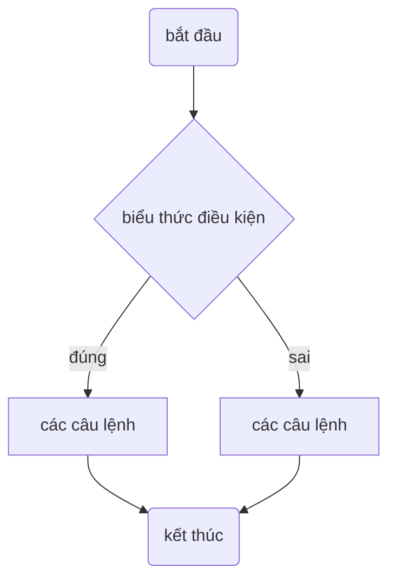
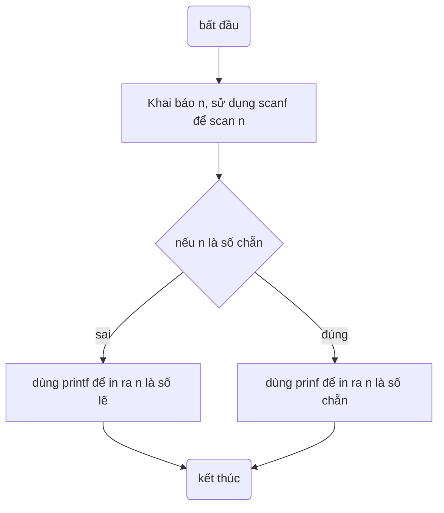
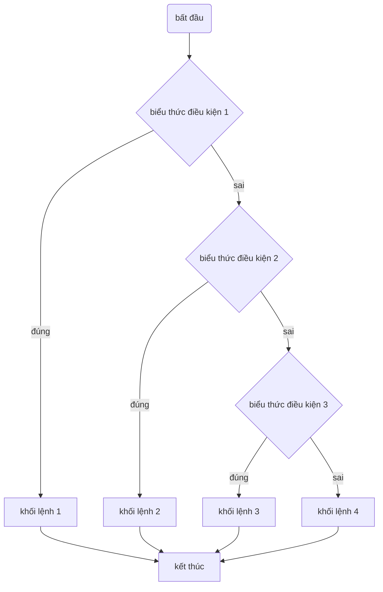

# CẤU TRÚC RẼ NHÁNH
## 1. toán tử `if`
```c
if (biểu thức điều kiện)
{
	// thực hiện các câu lệnh nếu biểu thức điều kiện ĐÚNG (khác 0)
}
else
{
	// thực hiện các câu lệnh nếu biểu thức SAI (bằng 0)
}
```

**Bài 1: Odd or Even (Bitwise version)**
- Nhập số nguyên `n`.

- - Dùng `if-else` và toán tử `%` để kiểm tra **chẵn/lẻ**.

**Bài 2: Find Max of Three**

- Nhập 3 số nguyên `a`, `b`, `c`.
- Dùng `if-else` lồng nhau để tìm **số lớn nhất**.
```
- nhập giá trị a,b,c từ bàn phím
- nếu a > b thì max = a nếu không thì max = b
- nếu max < c thì max = c
```
## Toán tử `else if`
Cú pháp
```
if(biểu thức điều kiện 1)
{
	// khối lệnh 1
}
else if (biểu thức điều kiện 2)
{
	// khối lệnh 2
}
else if (biểu thức điều kiện 3)
{
	// khối lệnh 3
}
else
{
	// khối lệnh 4
}
```

**Bài 5: Grade Classification**

- Nhập điểm (float) của sinh viên `0.0 → 10.0`.
- Xếp loại học lực:
    - `điểm >= 8.0`: giỏi
    - `6.5 <= điểm < 8.0`: Khá
    - `5.0 <= điểm < 6.5`: Trung bình
    - `điểm < 5.0`: yếu
